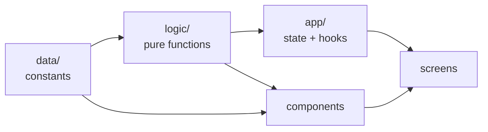
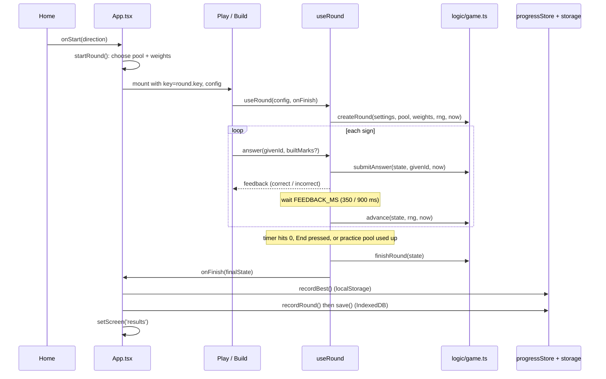
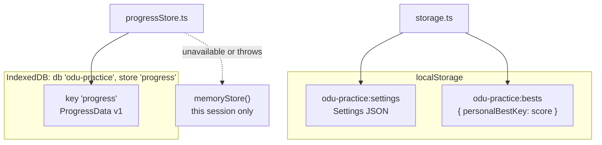
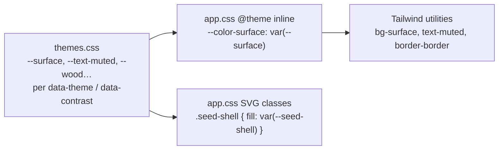

# Architecture Overview

This guide is for engineers who are new to the codebase. It assumes you know React and TypeScript. After reading it you should know where things live, how data moves through the app, and which rules you must not break when you edit it.

For setup commands and the data-editing rules, see the [README](../README.md).

---

## Contents

1. [What the app does](#1-what-the-app-does)
2. [Domain primer: just enough Ifá to read the code](#2-domain-primer-just-enough-ifá-to-read-the-code)
3. [Tech stack at a glance](#3-tech-stack-at-a-glance)
4. [Repository map and the layer rule](#4-repository-map-and-the-layer-rule)
5. [Boot sequence](#5-boot-sequence)
6. [The app shell: navigation, context and announcements](#6-the-app-shell-navigation-context-and-announcements)
7. [Life of a round](#7-life-of-a-round)
8. [The Odù data model](#8-the-odù-data-model)
9. [Persistence](#9-persistence)
10. [Drawing signs](#10-drawing-signs)
11. [Styling system](#11-styling-system)
12. [Rules you must not break](#12-rules-you-must-not-break)
13. [Testing](#13-testing)
14. [Build, CI and deploy](#14-build-ci-and-deploy)
15. [How do I…](#15-how-do-i)
16. [Gotchas](#16-gotchas)

---

## 1. What the app does

Mọ Odù helps Ifá practitioners learn to recognize Odù signs quickly. There are two ways to play:

- **Read the sign**: the app shows a sign, and the player picks its name from four choices.
- **Build the sign**: the app shows a name, and the player builds its sign by tapping eight positions.

Rounds are timed (1 or 2 minutes, with optional extended time) or untimed. Every answer is recorded on the device, and the Progress screen turns that history into accuracy charts, a list of the player's weakest Odù, and their most common mix-ups. A "My weak Odù" set weights future rounds toward the signs the player misses most.

The app runs entirely in the browser: there is no server, no account and no analytics. It is a PWA that installs and works offline, and it is hosted on GitHub Pages.

The original product brief is in [`odu-practice-game-prompt.md`](../odu-practice-game-prompt.md). Read it once: it explains many decisions that look arbitrary in the code, such as tone, spelling, accessibility targets and timings.

---

## 2. Domain primer: just enough Ifá to read the code

| Term                        | What it means in the code                                                                                                                                                  |
| --------------------------- | -------------------------------------------------------------------------------------------------------------------------------------------------------------------------- |
| **Mark**                    | The smallest unit of a sign. Either a **single** mark `I` (stored as `1`) or a **double** mark `II` (stored as `2`). Type: `Mark` in [`data/odu.ts`](../src/data/odu.ts).  |
| **Leg**                     | A column of four marks, read top to bottom. Type: `LegPattern`.                                                                                                            |
| **Principal Odù** (Ojú Odù) | One of the 16 named leg patterns, such as Ogbè (`I I I I`) or Ọ̀yẹ̀kú (`II II II II`). They have a fixed order of **seniority** from 1 to 16.                                |
| **Sign / Odù**              | Two legs side by side, which makes 8 marks. Since 16 × 16 = **256** Odù, the app generates all 256 from the 16 principal ones.                                             |
| **Right leg / left leg**    | Signs are drawn from the diviner's point of view. The **right leg is on the player's right and is read first.**                                                            |
| **Méjì**                    | The same principal Odù on both legs (16 of them). Named "_X_ Méjì", except Ogbè + Ogbè, which is **Èjì Ogbè**.                                                             |
| **Ọmọ Odù**                 | Any of the 240 combinations with two different legs. Named "_right_ _left_", for example Ọ̀sá Ìrẹtẹ̀.                                                                        |
| **Opẹ̀lẹ̀** (mode `opele`)    | A divining chain of 8 half-seed pods. Each seed lands **open** or **closed**, which maps to a single or double mark. The mapping varies by lineage, so it is configurable. |
| **Ọpọ́n Ifá** (mode `opon`)  | A round wooden tray. Marks are drawn in powder (ìyẹ̀rọ̀sùn): one stroke for single, two strokes for double.                                                                  |
| **ẹsẹ Ifá**                 | Verses from the Ifá corpus. These appear on study cards, and only content from the project owner or an approved source may be used.                                        |

In code vocabulary:

- `Mode` is the tool, `'opele' | 'opon'`.
- `Direction` is the game type, `'read' | 'build'`.
- `OduSet` is the pool of signs, `'meji' | 'all' | 'weak'`.

---

## 3. Tech stack at a glance

| Concern            | Choice                                                                                                |
| ------------------ | ----------------------------------------------------------------------------------------------------- |
| UI                 | React 19 function components and hooks. No state library, no router.                                  |
| Language           | TypeScript, strict, with `noUncheckedIndexedAccess`. That is why you'll see `arr[i]!` often.          |
| Build / dev server | Vite 8                                                                                                |
| Styling            | Tailwind CSS v4 utilities, with theme tokens held in CSS variables                                    |
| Offline / install  | `vite-plugin-pwa` (Workbox service worker with auto-update)                                           |
| Storage            | `localStorage` for settings and personal bests; IndexedDB (through `idb-keyval`) for progress history |
| Fonts              | Self-hosted Noto Sans and Noto Serif Display (`@fontsource`). These cover the Yoruba diacritics.      |
| Unit tests         | Vitest with jsdom and `fake-indexeddb`                                                                |
| E2E / a11y tests   | Playwright with axe-core (WCAG 2.2 AA), run on desktop and phone viewports in every theme             |
| Lint / format      | ESLint (type-checked rules plus react-hooks), and Prettier with the Tailwind class-sorting plugin     |
| Hosting            | GitHub Pages, deployed by a GitHub Actions workflow on every push to `main`                           |

---

## 4. Repository map and the layer rule

```
index.html              Root HTML. Contains an inline script that applies the theme before first paint.
vite.config.ts          Vite, Tailwind, PWA manifest, Vitest config. BASE path lives here.
src/
  main.tsx              Entry: fonts, CSS, service worker registration, <App/>.
  data/                 EDITABLE SOURCE OF TRUTH. Plain constants, no logic.
    odu.ts              The 16 principal Odù, naming constants, aliases.
    config.ts           Tunable numbers: timings, round lengths, opẹ̀lẹ̀ mapping, weak-Odù weights.
    ese.ts              Study content (meanings, ẹsẹ). Gated by `reviewed`.
    sounds.ts           Sound-cue presets (notes, timbre, master volume).
  logic/                PURE TYPESCRIPT. No React. Unit-tested.
    odu.ts              Builds the 256, owns the naming rule, lookup and search.
    game.ts             Round state machine: createRound / submitAnswer / advance / finishRound.
    distractors.ts      Picks plausible wrong answers for Read mode.
    build.ts            Build-mode cell state, checking, and screen-reader wording.
    progress.ts         Answer and round records, statistics, roll-up, weak-Odù weighting.
    progressStore.ts    IndexedDB persistence, memory fallback, export/import validation.
    storage.ts          Settings and personal bests in localStorage.
    random.ts           Injectable RNG (seeded for tests), shuffle, weighted pick.
    study.ts            Which study entries may be shown.
    sound.ts            Web Audio synth that plays the cue presets.
  app/                  REACT GLUE. Owns app state and wires logic to UI.
    App.tsx             Shell: screen switching, progress loading, startRound/finishRound.
    AppContext.tsx      Context: settings, updateSettings, announce, openStudy.
    AppBar.tsx          Navigation (bottom tabs on phones, sidebar on wide screens).
    useRound.ts         Hook that runs a round: clock, feedback delay, announcements, sound.
    useMediaQuery.ts    Media query hook plus WIDE_QUERY.
  screens/              One component per screen (Home, Play, Build, Results, Progress, ...).
  components/           Reusable UI: sign drawings, choices, sheet, charts.
    ui.ts               Shared Tailwind "class recipes" (button(), card(), hint, ...).
  lib/cn.ts             clsx + tailwind-merge, extended with the custom theme names.
  styles/
    app.css             Tailwind entry: @theme tokens, custom variants, base styles, SVG classes.
    themes.css          Color tokens for Light / Dark / Night / High-contrast.
tests/
  unit/                 Vitest (logic plus a few screen tests).
  e2e/                  Playwright (game flows plus axe scans).
.github/workflows/deploy.yml   CI: lint, typecheck, unit tests, build, deploy to Pages.
scripts/generate-icons.mjs     Regenerates PWA PNG icons from favicon.svg.
```

### The layer rule



- **`data/` imports nothing** except types.
- **`logic/` never imports React.** Time and randomness are passed in: functions take `now: number` and `rng: Rng` as arguments instead of calling `Date.now()` or `Math.random()`. This keeps them deterministic and easy to test. The one exception is `storage.ts` and `progressStore.ts`, which touch browser storage, and they wrap every access in `try/catch`.
- **`app/` and `screens/` own all React state.** When you add behavior, put the rule in `logic/` with a unit test, and keep the React side as thin wiring.

---

## 5. Boot sequence

1. **[`index.html`](../index.html)** runs a small inline script _before_ React loads. It reads settings from `localStorage` and sets `data-theme`, `data-contrast`, `data-large` and `data-spacing` on `<html>`, so a dark-mode user never sees a white flash.
2. **[`main.tsx`](../src/main.tsx)** imports the font subsets and `app.css`, registers the service worker (`registerSW({ immediate: true })`), and renders `<App/>` inside `StrictMode`.
3. **[`App.tsx`](../src/app/App.tsx)** on mount:
   - loads settings synchronously from `localStorage` (`useState(loadSettings)`).
   - starts with an **in-memory** progress store and empty progress, then asynchronously opens IndexedDB (`openProgressStore()`). It swaps in the real store and data when that resolves. If IndexedDB is unavailable, the app keeps the memory store and the Progress screen warns that data won't be saved.
   - keeps the `<html>` data attributes in sync with settings (`useDocumentSettings`), including following the OS light/dark preference when the theme is "system".

---

## 6. The app shell: navigation, context and announcements

### Screens without a router

GitHub Pages serves a single URL, so the app has no router. `App` holds:

```ts
type Screen = 'home' | 'round' | 'results' | 'progress' | 'reference' | 'help' | 'settings';
const [screen, setScreen] = useState<Screen>('home');
```

and renders one screen with `{screen === 'x' && <X/>}`. Navigation goes through `go(next)`, which also scrolls to the top. Help is the only screen with a Back button: `helpReturn` remembers where the user came from, and `HELP_BACK` holds the label for that button.

The nav bar ([`AppBar.tsx`](../src/app/AppBar.tsx)) is hidden during a round so the round can use the full screen.

### Shared state: `AppContext`

[`AppContext.tsx`](../src/app/AppContext.tsx) exposes four things through `useApp()`:

| Value                         | Purpose                                                                                                                                                                       |
| ----------------------------- | ----------------------------------------------------------------------------------------------------------------------------------------------------------------------------- |
| `settings`                    | The current `Settings` object (see [`storage.ts`](../src/logic/storage.ts)).                                                                                                  |
| `updateSettings(patch)`       | Merge, persist to `localStorage`, re-render.                                                                                                                                  |
| `announce(text)`              | Speak text through a single polite `aria-live` region at the bottom of `App`. It clears the region and re-sets the text after 50 ms, so a repeated message is still read out. |
| `openStudy(oduId, { mode? })` | Open the study card dialog for an Odù from anywhere.                                                                                                                          |

Everything else, such as progress data, the current round and the round outcome, lives in `App` and is passed down as props. Screens tell `App` what happened through callbacks like `onStart`, `onFinish` and `onReplace`.

### Two layout mechanisms

- **Navigation chrome** switches at Tailwind's `md` breakpoint (48rem): a bottom tab bar on phones, a left sidebar on wide screens. `WIDE_QUERY` in `useMediaQuery.ts` must match this breakpoint.
- **Screen content** uses a **container query** on `<main>` (`@container/app`) with the custom size `@wide/app:` (50rem). Content therefore responds to the width of the main column, not the viewport. Use `@wide/app:` for two-column layouts inside screens.

---

## 7. Life of a round

This is the most important flow in the app.



### Step by step

**1. Choosing the pool: `startRound` in `App.tsx`**

- **Méjì**: the 16 Méjì ids. **All**: all 256 ids.
- **Weak**: every Odù the player has attempted in this direction (`weakPool`), padded with the Méjì if fewer than 4. `weakWeights` gives each Odù a weight from its inaccuracy and slowness, with a floor so strong Odù still come up. The weak set is only offered after `WEAK_SET_MIN_ANSWERS` (20) answers; before that, a stored `'weak'` choice falls back to Méjì.
- **Practice my misses** (from Results): the pool is the missed ids, shown once each, in order, untimed.

Each round gets a new `key`. React therefore **remounts** `Play` or `Build`, and `useRound` always starts from fresh state.

**2. Running the round: [`useRound.ts`](../src/app/useRound.ts)**

The hook is shared by Read and Build. It owns everything time-based:

- **Clock**: a 250 ms interval compares the time against a fixed `endAt` timestamp, so it doesn't drift. It announces "30 seconds left" and "10 seconds left" to screen readers.
- **`answer(givenId, builtMarks?)`** calls `submitAnswer`, shows feedback, plays a sound cue if enabled, and announces the result. After `FEEDBACK_MS` it calls `advance`. While feedback is showing, further answers are ignored.
- **`finish()`** is guarded by `finishedRef`, so it runs only once whether it is triggered by the timer, the End button or the end of a practice pool.

The hook keeps a `stateRef` alongside its React state, so timeouts and intervals always see the latest round state without having to re-subscribe.

**3. Game rules: [`logic/game.ts`](../src/logic/game.ts)**

`RoundState` is an immutable object. Every function returns a new one:

| Function                            | Does                                                                                                                                     |
| ----------------------------------- | ---------------------------------------------------------------------------------------------------------------------------------------- |
| `createRound`                       | Picks the first sign and builds the Read choices (through `distractors.ts`).                                                             |
| `submitAnswer`                      | Scores the answer and records an `AnswerEvent` (with response time) plus a `Miss` if wrong. **Does not advance.**                        |
| `advance`                           | Picks the next sign. It avoids repeats until the pool is used up, never shows the same sign twice in a row, and uses weights if present. |
| `finishRound`                       | Sets `status: 'finished'`. **The sign on screen when time runs out is not scored.**                                                      |
| `roundDuration` / `personalBestKey` | Time limit and best-score key. Untimed and practice rounds have neither.                                                                 |

**4. Read vs Build screens**

- [`Play.tsx`](../src/screens/Play.tsx) (Read): draws the sign and shows four `AnswerChoices`. Keys 1–4 or A–D answer.
- [`Build.tsx`](../src/screens/Build.tsx): draws an _editable_ sign with 8 cells. Tapping a cell cycles it empty → single → double → empty. Arrow keys move between cells, `1`/`2` set a mark, Backspace clears, Enter checks. **Mirror legs** (Méjì set only) copies each mark to the other leg. When the target changes (tracked by `state.shownAt`), the cells reset during render. This is React's "adjust state when a prop changes" pattern, used instead of an effect. The Check button turns the 8 marks into an Odù id with `checkBuild`, and the screen passes that id to `answer()`, so Build and Read share the same scoring path.

**5. Recording: `finishRound` in `App.tsx`**

- `recordBest(key, score)` stores a personal best in `localStorage`, keyed by mode, direction, set and length (plus extended time).
- If anything was attempted, it turns each `AnswerEvent` into an `AnswerRecord` and calls `recordRound()`, then `saveProgress()`, which writes IndexedDB.
- It shows Results and announces the score.

---

## 8. The Odù data model

### From 16 to 256

[`data/odu.ts`](../src/data/odu.ts) lists only the 16 principal Odù (`id`, `name` with diacritics, `seniority`, `pattern`, `altSpellings`). [`logic/odu.ts`](../src/logic/odu.ts) builds all 256 at module load:

```ts
interface Odu {
  id: string; // `${right.id}_${left.id}`, e.g. 'osa_irete'
  name: string; // from composeName()
  nameNoDiacritics: string;
  right: PrincipalOdu;
  left: PrincipalOdu;
  aliases: string[]; // from ODU_ALIASES, search + study card only
  isMeji: boolean;
  marks: Mark[]; // 8 marks: right leg top→bottom, then left leg top→bottom
}
```

Exports you'll use all the time:

- `ALL_ODU` and `MEJI_ODU`.
- `getOdu(id)`, which **throws** on an unknown id, and `findOdu(id)`, which returns `undefined`.
- `oduFromMarks(marks)`, which looks up an Odù from its 8 marks.
- `displayName(odu, showDiacritics)` and `searchOdu(query)`.

### The naming rule

`composeName(right, left)` is **the only place names are composed**:

- Ogbè + Ogbè → `Èjì Ogbè`
- X + X → `X Méjì`
- X + Y → `X Y` (right leg first)

In JSX, render names with `<OduName id=…/>` (or `<Yo>` for other Yoruba text). Both wrap the text in `lang="yo"` and apply the "show diacritics" setting.

### Positions 0–7

All sign code shares one layout. **Indexes 0–3 are the right leg, top to bottom; indexes 4–7 are the left leg, top to bottom.** In Build mode a cell can also be `0` (empty), so the type is `Cell = 0 | Mark`.

```
   player's left        player's right
   (left leg, read 2nd) (right leg, read 1st)
        [4]                  [0]
        [5]                  [1]
        [6]                  [2]
        [7]                  [3]
```

### Distractors (Read mode)

[`distractors.ts`](../src/logic/distractors.ts) picks three wrong answers that test real reading skill:

- **Méjì set**: other Méjì ordered by how close their pattern is (1 mark different, then 2, and so on).
- **All and weak sets**: the leg-swapped sign first, then one sign that differs by a single mark, then signs that share a leg. This forces the player to read both legs.

---

## 9. Persistence



### Settings and bests: [`storage.ts`](../src/logic/storage.ts)

- `parseSettings` validates every field and falls back to `DEFAULT_SETTINGS` for anything unknown. The `'weak'` set is **never restored** on load, because it depends on progress data that hasn't loaded yet.
- Every `localStorage` call is wrapped in `try/catch`, so private browsing and blocked storage still work for the session.

### Progress: [`progress.ts`](../src/logic/progress.ts) and [`progressStore.ts`](../src/logic/progressStore.ts)

```ts
interface ProgressData {
  version: 1;
  answers: AnswerRecord[]; // most recent MAX_STORED_ANSWERS (10,000) in full
  rounds: RoundRecord[];
  rollup: {
    // older answers summed so long-term stats survive
    odu: { 'oduId|mode|direction': { attempts; correct; totalMs } };
    mixups: { 'targetId>givenId|mode|direction': count };
  };
}
```

- `recordRound` appends a round and its answers, then calls `rollUp`, which moves answers beyond the cap into the totals.
- Every statistic (`oduStats`, `weakestOdu`, `mixUps`, `overview`, `currentStreak`, `scoreSeries`) combines the rolled-up totals with the recent answers, so numbers stay correct after a roll-up.
- `openProgressStore()` tests IndexedDB once. If it throws at any point, the store switches to an in-memory fallback, and `persistent` becomes `false` so the UI can warn the user.
- **Export/import** (Progress screen): `exportProgress` writes JSON tagged `format: 'odu-practice-progress'`. `parseImport` → `validateProgress` checks every record strictly: known Odù ids, `correct === (oduId === givenId)`, score ≤ attempted, valid roll-up keys, and so on. Stored data goes through the same validation when it is loaded.

---

## 10. Drawing signs

All sign art is hand-written inline SVG. There are no image assets.

```
<Sign mode cells …>                 components/Sign.tsx: picks the drawing for the mode
  ├─ <Opele>                        components/Opele.tsx: cord, beads, open/closed seeds
  └─ <OponIfa>                      components/OponIfa.tsx: tray, carving, powder strokes
        └─ <SignFrame>              components/SignFrame.tsx: shared wrapper
              ├─ <svg viewBox> with role="img" + generated aria-label
              ├─ wrong-position markers (Results screen)
              └─ editable? → 8 absolutely-positioned <button>s over the SVG (Build)
```

- **Geometry** ([`signGeometry.ts`](../src/components/signGeometry.ts)) defines each drawing's viewBox, the x position of each leg, the y position of each row, and the size of the tap area. `positionPoint(g, index)` converts an index from 0–7 into coordinates. Change the layout here, not in the individual drawings.
- **Text alternative**: `signDescription()` produces text such as "Opẹ̀lẹ̀. Right leg, top to bottom: open, open, open, closed. Left leg: …". Pass `decorative` when the surrounding control already names the sign.
- **Opẹ̀lẹ̀ seeds** are drawn from `OPELE_MAPPING` in config. Never assume that open means single.
- **Editable mode** uses a roving tabindex: only the active cell has `tabIndex=0`, and each cell button has a full label such as "Right leg, mark 2 of 4: double".
- **Sizing**: `size` sets `--sign-width`. On the round stage, `STAGE_FIT` (in [`roundLayout.ts`](../src/screens/roundLayout.ts)) also limits the height using `--aspect`.
- **Colors**: SVG parts use class names (`.seed-shell`, `.tray-mark`, `.cord`, …) styled in `app.css` from theme variables, so every drawing adapts to Dark, Night and High-contrast.

The charts (`components/charts/`) follow the same approach: hand-written SVG, theme-variable colors, and an accessible data table next to each chart (`ChartFrame`).

---

## 11. Styling system

### Tokens flow



- **Never use raw hex colors or `dark:` variants in components.** Use the semantic utilities (`bg-surface`, `bg-stage`, `text-fg`, `text-muted`, `border-border`, `bg-accent`, `text-correct`, …). Themes swap the underlying variables at runtime.
- **Custom variants** (defined in `app.css`) respond to the accessibility settings on `<html>`:
  - `large:` for large text
  - `roomy:` for large text or dyslexia-friendly spacing
  - `hc:` for high contrast
  - `short:` for short viewports
- **Class recipes** in [`components/ui.ts`](../src/components/ui.ts) cover the looks that repeat across screens: `button({ variant, size, block })`, `card()`, `panel`, `hint`, `eyebrow`, `notice`, `page`, `stack`, `oduList`/`oduButton()`. Reuse them before writing new class strings.
- **`cn()`** in [`lib/cn.ts`](../src/lib/cn.ts) is `clsx` plus `tailwind-merge`, so a `className` passed from outside overrides a component's defaults. tailwind-merge has been told about the custom theme names; see the gotcha in section 16.
- Prettier sorts Tailwind classes automatically, including inside `cn(...)`. Run `pnpm format`.

---

## 12. Rules you must not break

These are product requirements, enforced by review and tests.

### Cultural and content correctness

- **Spelling**: Yoruba follows standard orthography with full tone marks and underdots, as written in `data/odu.ts`. Don't simplify it or substitute Lucumí, Spanish or Portuguese forms. "Show diacritics off" only changes what is _displayed_.
- **Never invent content.** Don't generate, paraphrase or "fill in" ẹsẹ, translations, meanings or aliases. Only entries with `reviewed: true` in [`data/ese.ts`](../src/data/ese.ts) are shown. The example placeholder entry exists only in dev builds (`import.meta.env.DEV`).
- **Names come only from `composeName`.** Don't build Odù names by hand anywhere else.
- **Tone**: calm and respectful. No jokey copy, mascots or game-show styling.

### Accessibility (WCAG 2.2 AA in every theme)

- Every control must be reachable and usable by keyboard, with a visible focus ring.
- Touch targets must be at least 44 × 44 px.
- **Never use color alone** to carry meaning. Pair it with an icon, text, shape or pattern; feedback banners, for example, show ✓ or ✕ next to the text.
- Announce state changes through `announce()`. Don't add more `aria-live` regions.
- Animations respect `prefers-reduced-motion` (use `motion-safe:`).
- Put Yoruba text in `lang="yo"` (use `<OduName>` / `<Yo>`).
- Charts need a table alternative.

### Data stability

- **Never change an existing Odù `id`.** Saved progress, exports and roll-up keys all refer to Odù by id.
- Don't change the `ProgressData` shape without a version bump and a migration (see section 16).

---

## 13. Testing

| Command                                              | What runs                                                                                                                   |
| ---------------------------------------------------- | --------------------------------------------------------------------------------------------------------------------------- |
| `pnpm test`                                          | Vitest unit tests in `tests/unit/` (jsdom, `fake-indexeddb` from `setup.ts`)                                                |
| `pnpm test:e2e`                                      | Playwright in `tests/e2e/`. It builds the app, serves `vite preview`, and runs on **desktop Chrome and Pixel 7** viewports. |
| `pnpm lint` / `pnpm typecheck` / `pnpm format:check` | Static checks                                                                                                               |

**Unit tests** cover the pure logic: naming, distractors, game, build, progress, study. Use `seededRng(seed)` from `random.ts` and pass explicit `now` values so tests are deterministic.

A few screen tests (`home-screen`, `settings-screen`, `odu-reference`, `opele-seeds`) render components with `createRoot` and `act`, wrapped in a real `AppContext.Provider`. There is no Testing Library; copy the `Harness` pattern from `home-screen.test.tsx`.

**E2E tests**:

- `game.spec.ts` plays real rounds.
- `a11y.spec.ts` runs axe (WCAG 2.2 AA) on every screen in **Light, Dark, Night and High-contrast**.
- `helpers.ts` provides `openWith(page, settings)` to start the app with given settings, and helpers like `startRound` and `goTo`.
- Service workers are blocked during e2e runs.

> CI runs lint, typecheck and unit tests, but **not** the Playwright suite. Run `pnpm test:e2e` locally before merging UI changes. The first time, run `pnpm exec playwright install chromium`.

---

## 14. Build, CI and deploy

- `pnpm build` runs `tsc -b` and then `vite build`, which outputs to `dist/`.
- [`.github/workflows/deploy.yml`](../.github/workflows/deploy.yml) runs on every push to `main`. It installs dependencies (frozen lockfile), then runs lint, typecheck, unit tests and the build, then deploys `dist/` to GitHub Pages. If any check fails, nothing is deployed.
- **Base path**: `BASE = '/odu-ifa-game/'` in [`vite.config.ts`](../vite.config.ts) is used by Vite, the PWA manifest (`start_url`, `scope`) and the service worker fallback.
- **PWA**: Workbox precaches all JS, CSS, HTML, SVG, PNG and woff2 files. `registerType: 'autoUpdate'` means a new deploy takes over the next time the app is loaded.
- Requirements: Node ≥ 24 and the pnpm version pinned in `package.json` (`corepack enable pnpm`).

---

## 15. How do I…

### …change a timing, round length or weighting?

Edit [`src/data/config.ts`](../src/data/config.ts). Every tunable number is there with a comment. Keep `FEEDBACK_MS.correct` under 400 ms (a product requirement). If you change `ROUND_LENGTHS`, note that `validateProgress` will reject imported rounds that use a length that no longer exists.

### …fix an Odù name, pattern or alias?

Edit [`src/data/odu.ts`](../src/data/odu.ts). Change `name`, `pattern` or `ODU_ALIASES`, **never `id`**. Only add aliases that have been verified. All 256 names update automatically. Run `pnpm test`, since `odu.test.ts` checks the naming rule and that every pattern is unique.

### …add study content (meaning / ẹsẹ)?

Follow the README section "Adding ẹsẹ Ifá and meanings". In short: edit `src/data/ese.ts`, include a `source` for every snippet, and set `reviewed: true` only after review.

### …add a new user setting?

1. In [`logic/storage.ts`](../src/logic/storage.ts), add the field to `Settings`, to `DEFAULT_SETTINGS` and to `parseSettings`, with validation.
2. Add a control in [`screens/Settings.tsx`](../src/screens/Settings.tsx). For a boolean, use the existing `toggle(key, label, hint)` helper. Otherwise use `<Choices>` with `updateSettings({ … })`.
3. Read it anywhere with `const { settings } = useApp()`.
4. **If it changes the page's look globally** (like large text):
   - set a `data-*` attribute in `useDocumentSettings` in `App.tsx`;
   - mirror that in the inline script in `index.html`, so it applies before first paint;
   - add a `@custom-variant` in `app.css`.
5. **If it changes how a round plays**, add it to `RoundSettings` in `logic/game.ts` and to `roundSettings` in `startRound`, and consider whether it belongs in `personalBestKey` and `roundSeriesKey`.
6. Add a case to `tests/unit/settings-screen.test.tsx`.

### …change or add a sound style?

Edit [`src/data/sounds.ts`](../src/data/sounds.ts). Add the id to `SOUND_STYLES` and a preset to `SOUND_PRESETS`; Settings lists it automatically. The default is `soundStyle` in `DEFAULT_SETTINGS` (`logic/storage.ts`). `tests/unit/sound-presets.test.ts` enforces the rules that keep correct and incorrect distinct (correct rises, sits higher and ends before `FEEDBACK_MS.correct`). Adjust overall loudness with `SOUND_VOLUME`, not per note.

### …add a new screen?

1. Create `src/screens/MyScreen.tsx`. Start with `<div className={page}>` and `<PageHead title=…>description</PageHead>`, which gives the screen its `<h1>`.
2. In `App.tsx`, add it to the `Screen` union and add a render branch inside `<main>`.
3. Make it reachable:
   - **As a tab**: add it to `Tab` and `TABS` in `AppBar.tsx`, and to the `activeTab` mapping in `App.tsx`.
   - **As a link**: call `go('myscreen')` from a callback prop.
   - **If Help can be opened from it**: add an entry to `HELP_BACK`.
4. Add the screen to the axe sweep in `tests/e2e/a11y.spec.ts`.

### …add a theme color?

1. Define the variable in [`themes.css`](../src/styles/themes.css) for **every** theme: light, dark, night, and the high-contrast block.
2. Expose it in the `@theme inline` block in `app.css` (`--color-foo: var(--foo);`).
3. Add `'foo'` to the `color` list in [`lib/cn.ts`](../src/lib/cn.ts).
4. Run `pnpm test:e2e` so axe checks contrast in every theme.

### …change game rules (scoring, sign selection)?

Edit [`logic/game.ts`](../src/logic/game.ts) (or `distractors.ts` / `build.ts`) and write the unit test first, using `seededRng`. The React layer (`useRound`) should only need changes if the rule involves time or UI feedback.

### …add a field to saved progress?

Read the last gotcha in section 16 first. You'll need to:

- bump `version`;
- teach `validateProgress` to accept and migrate old versions;
- update `exportProgress` / `parseImport`;
- add tests to `progress.test.ts`.

### …deploy to a custom domain?

Set `BASE = '/'` in `vite.config.ts` and add `public/CNAME`. Also update the two hard-coded `/odu-ifa-game/` URLs in `playwright.config.ts`.

---

## 16. Gotchas

- **Two keys have to stay in sync by hand.**
  - `SETTINGS_KEY` (`'odu-practice:settings'`) in `storage.ts` must match the key in the inline script in `index.html`, and the e2e helper `openWith`.
  - `WIDE_QUERY` (48rem) in `useMediaQuery.ts` must match Tailwind's `md` breakpoint used by the nav.
- **New theme names must be registered with `cn()`.** If you add a color, shadow or radius token without listing it in `lib/cn.ts`, tailwind-merge doesn't know what the class is. It can then drop the wrong class, for example treating `text-foo` as a font size and removing a real `text-[0.9rem]`.
- **`getOdu` throws** on an unknown id. Use `findOdu` when the id comes from outside (imports, URLs, storage).
- **Rounds remount on purpose.** `Play`/`Build` are keyed by `round.key`, so all their state starts fresh each round. Don't try to "reset" round state by hand.
- **`StrictMode` runs effects twice in dev.** Effects need to clean up properly; the progress-store loader uses a `canceled` flag for this.
- **Weak set fallback.** `settings.set === 'weak'` is never restored from storage and falls back to Méjì until 20 answers exist. Don't "fix" this; it is intended.
- **Timing edge case.** The sign on screen when time runs out is not scored. If you change how rounds end, keep that rule; `game.test.ts` checks it.
- **Opẹ̀lẹ̀ mapping is configurable.** Use `OPELE_MAPPING` and `seedWord()`; never hard-code open = single.
- **Left/right is from the diviner's view.** Index 0–3 (the right leg) is drawn on the _player's right_, and ArrowLeft in Build moves to the left leg.
- **The e2e suite isn't in CI.** A green deploy doesn't mean the a11y checks pass; run `pnpm test:e2e` yourself.
- **Stored progress that fails validation is replaced, not repaired.** `progressStore.load()` returns `emptyProgress()` when the stored data fails `validateProgress`, and the next `save()` overwrites it. A schema change that makes old data invalid would **silently wipe users' history**. Always add a version bump and a migration.
